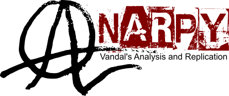

AnarPy - ANalysis And Replication in PYthon
==============================

AnarPy is a Python package to facilitate the simulation, analysis, and replication of several experiments using computational whole brain models.
For more details, installation instructions, documentation, tutorials, forums, videos and more, please visit: https://anarpy.readthedocs.io

This package is developed and maintained by the Valparaíso Neural Dynamics Laboratory at Universidad de Valparaíso (https://vandal-uv.github.io/)

License
------------
The source code for the site is licensed under the MIT license, which you can find in the LICENSE file.

Citation
------------

Contact
------------
Principal Investigator: Patricio Orio (patricio.orio@cinv.cl)
Maintainers: 
      Javier Palma-Espinosa (javier.palma@cinv.cl)
      Ignacio Ampuero (ignacio.ampuero@uv.cl)
